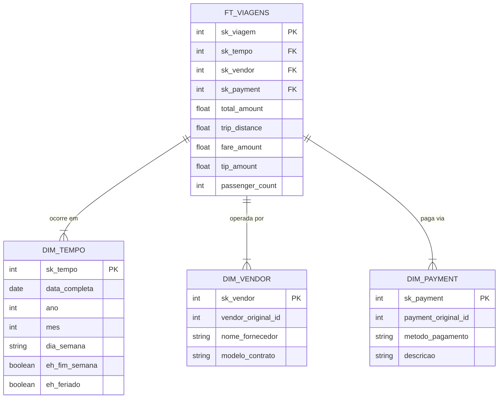

# Item 6 - Modelagem de Dados (Kimball Star Schema)

> **Contexto & Decisão:** Após analisar o cenário de Analytics para a frota Yellow Taxi, optei pela arquitetura de Data Warehouse seguindo a modelagem dimensional **Kimball - Star Schema (Esquema Estrela)**. Esta decisão foi estratégica para transformar dados brutos em uma estrutura otimizada para alta performance em Dashboards (Streamlit/Metabase), garantindo escalabilidade e clareza analítica.

### ✍️ Relato Pessoal
Ao iniciar a estruturação, percebi que o maior desafio era a redundância: nomes de fornecedores e métodos de pagamento repetidos em milhões de linhas geram custos desnecessários de processamento. 

Utilizei a Engenharia de Dados para "quebrar" a tabela única (Flat Table) original. Minha escolha pelo modelo Kimball, em detrimento do Data Vault, foi pautada no pragmatismo: para o contexto de Business Intelligence e visualização rápida, o Star Schema é imbatível. Ele reduz a complexidade de `JOINs` e torna o dado amigável para o consumo humano, acelerando o tempo de entrega de valor para as áreas de negócio.

### 💡 O Insight de Negócio
A modelagem é uma ferramenta de redução de custo operacional. No modelo original, responder perguntas como "Qual o faturamento do fim de semana?" exigia um cálculo computacional pesado registro a registro. Com a implementação da **DIM_TEMPO**, transformamos lógica complexa em um filtro simples de metadados. Isso permite que a diretoria visualize tendências sazonais em milissegundos, transformando o engenheiro de dados em um facilitador da agilidade empresarial.

### 🛠️ Detalhes Técnicos
* **Estratégia Dimensional:** Separação entre Fatos (FT_VIAGENS) e Dimensões (Tempo, Fornecedor e Pagamento).
* **Otimização de Performance:** Tabelas de Dimensão reduzidas que armazenam atributos qualitativos, permitindo que a Tabela Fato contenha apenas chaves (FK) e métricas numéricas.
* **Abstração por Views:** Criação de camadas lógicas em SQL para simplificar o acesso aos dados por diferentes perfis de usuários (Financeiro e Operacional).

### 🗄️ SQL Views
* View 1: Performance Financeira*
> **Foco:** Faturamento, Rentabilidade e Métodos de Pagamento

```SQL
    CREATE VIEW vw_kpi_financeiro AS
    SELECT 
        t.ano, t.mes,
        v.nome_fornecedor,
        p.metodo_pagamento,
        SUM(f.total_amount) as receita_total,
        AVG(f.total_amount) as ticket_medio,
        SUM(f.tip_amount) as total_gorjetas
    FROM FT_VIAGENS f
    JOIN DIM_TEMPO t ON f.sk_tempo = t.sk_tempo
    JOIN DIM_VENDOR v ON f.sk_vendor = v.sk_vendor
    JOIN DIM_PAYMENT p ON f.sk_payment = p.sk_payment
    GROUP BY t.ano, t.mes, v.nome_fornecedor, p.metodo_pagamento;
```

* View 2: Performance Operacional*
> **Foco:** Volume de corridas, distâncias e demandas sazonais.

```SQL
    CREATE VIEW vw_performance_operacional AS
    SELECT 
        t.dia_semana,
        t.eh_fim_semana,
        AVG(f.trip_distance) as distancia_media,
        SUM(f.passenger_count) as total_passageiros,
        COUNT(f.sk_viagem) as volume_viagens
    FROM FT_VIAGENS f
    JOIN DIM_TEMPO t ON f.sk_tempo = t.sk_tempo
    GROUP BY t.dia_semana, t.eh_fim_semana
    ORDER BY volume_viagens DESC;
```

### 📐 Diagrama do Esquema (DW)
*Item Bônus: Representação visual da camada Gold via Mermaid.*

